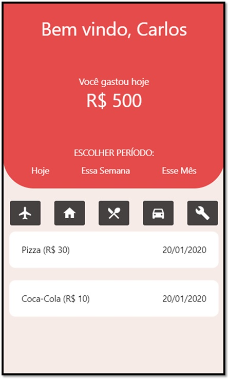
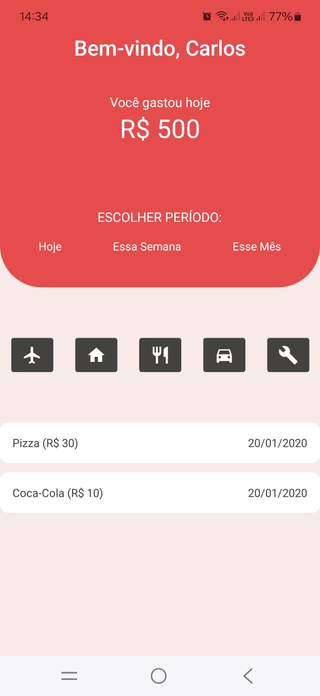

# I_Atividade_Extra-Lab_Prog_VI

## O objetivo desta atividade é criar um layout utilizando cores pré-definidas e ícones do Material Design ou do React Native Elements, conforme o framework escolhido.

### Instruções

#### Layout
O intuito é criar um layout que siga as especificações fornecidas abaixo. Se você estiver utilizando React, deve montar a interface com as cores e componentes indicados. Caso esteja utilizando React Native, adapte os componentes ao ambiente mobile, garantindo uma interface responsiva e funcional.

#### Adicionando Ícones
Para incluir ícones no seu layout, utilize os componentes recomendados de acordo com o seu framework:

React Native (React Native Elements): Se estiver utilizando React Native, o componente Button do React Native Elements pode ser usado, juntamente com ícones do Material Design. Alguns ícones sugeridos para essa atividade são:

- flight
- home
- local-dining
- directions-car
- build

### Resultado
Confira abaixo a imagem do layout final do projeto:
